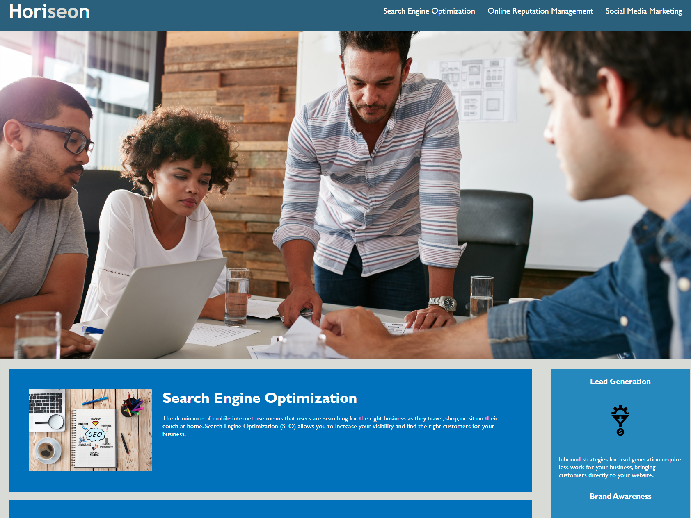

# Semantic-Refactor

## Overview

```
This repository contains the refactored code for the Horiseon home page, focusing on enhancing code readability, and accessibility through semantic improvements. The primary goals of this refactor were to:

Increase code clarity: Use meaningful elements and class names that accurately reflect their purpose.
Adhere to best practices: Follow established guidelines for code style and formatting.
Enhance accessibility: Ensure appropriate use of semantic HTML elements.
```

## Key Changes

```
Replaced presentational elements with semantic elements:
Replaced divs with more meaningful elements like header, main, article, section, aside, footer, etc.
Used appropriate heading levels (h1-h6) to establish content hierarchy.


Refactored CSS selectors:
Shifted from generic classes to more semantic selectors based on element types and attributes.
Consolidated redundant classes.
```

## Deployed Application

The following image shows the web application's appearance and functionality:



> **Note**: This layout is designed for desktop viewing, so you may notice that some of the elements don't look like the mock-up at a resolution smaller than 768px. Eventually you'll learn how to make elements responsive so that your web application is optimized for any screen size.


